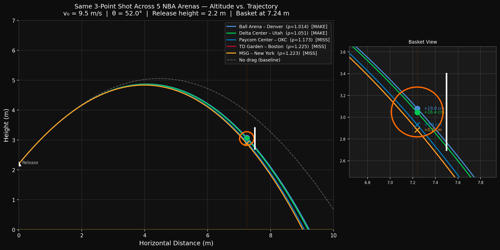

# NBA Shot Simulator - Altitude vs. Trajectory

> Does altitude actually affect a basketball shot? I built a physics simulator to find out.

## Overview

Denver's Ball Arena sits at **5,280 feet above sea level**, which is over a mile high. Madison Square Garden sits at **33 feet**. Every player who shoots in Denver is working with thinner air than they trained in.

Air resistance acts on every shot. And air resistance depends on air density. And air density drops with altitude. So the same shot — same player, same angle, same force — behaves differently depending on where you're playing.

This project simulates exactly that.

The current visualization compares the same calibrated three-point shot across multiple NBA arenas and shows how changes in air density affect the trajectory near the rim.

## How It Works

A basketball shot is a projectile under two forces:

**Gravity:**

$$F_g = mg$$

**Aerodynamic drag:**

$$F_{drag} = \frac{1}{2} \rho C_d A v^2$$

Where air density $\rho$ changes with altitude $h$ following the barometric formula:

$$\rho(h) = \rho_0 \cdot e^{-h/H}$$

- $\rho_0 = 1.225 \ \text{kg/m}^3$ (sea level air density)
- $H = 8500 \ \text{m}$ (atmospheric scale height)
- $C_d = 0.47$ (drag coefficient for a sphere)
- Basketball radius: $0.12 \ \text{m}$, mass: $0.623 \ \text{kg}$

The simulator numerically solves the projectile motion with aerodynamic drag using `scipy.integrate.solve_ivp`.

## Output

The main script generates `shot_comparison.png`, a trajectory comparison with a zoomed basket view.



## Getting Started

**Requirements:** Python 3.8+

```bash
git clone https://github.com/calsalo/NBA-Shot-Simulator
cd NBA-Shot-Simulator
pip install -r requirements.txt
python simulations/shot-visual.py
```

## Tech Stack

- Python
- NumPy — numerical computation
- Matplotlib — visualization and animation
- SciPy — numerical ODE solver

## Project Structure

```text
simulations/
  shot-visual.py      # Main visualization script
  drag-force.py       # Drag force calculations
  first-test.py       # Early prototype simulation
shot_comparison.png   # Generated comparison chart
requirements.txt
```

## References

- [MIT OCW 8.01 — Classical Mechanics](https://ocw.mit.edu/courses/8-01sc-classical-mechanics-fall-2016/)
- [MIT OCW 18.330 — Introduction to Numerical Analysis](https://ocw.mit.edu/courses/18-330-introduction-to-numerical-analysis-spring-2012/)
- NBA arena elevation data via public sources
